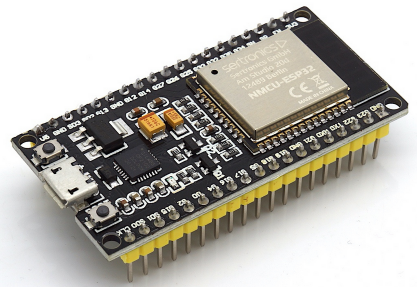
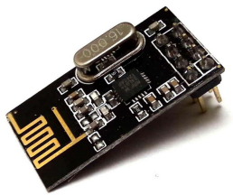
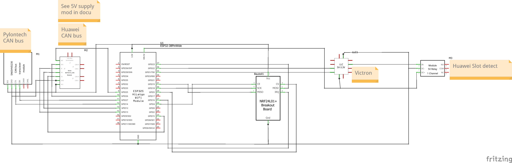
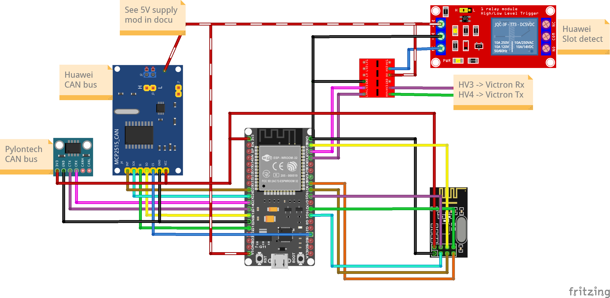
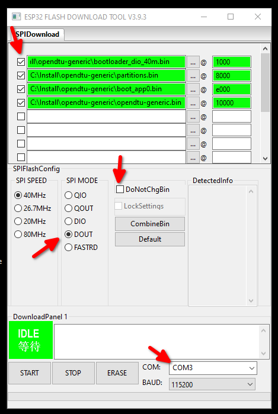

# OpenDTU

[](https://github.com/tbnobody/OpenDTU/actions/workflows/build.yml)
[](https://github.com/tbnobody/OpenDTU/actions/workflows/cpplint.yml)

## Background
This project was started from [this](https://www.mikrocontroller.net/topic/525778) discussion (Mikrocontroller.net).
It was the goal to replace the original Hoymiles DTU (Telemetry Gateway) with their cloud access. With a lot of reverse engineering the Hoymiles protocol was decrypted and analyzed.

## Screenshots
Several screenshots of the frontend can be found here: [Screenshots](docs/screenshots/README.md)

## Builds
Different builds from existing installations can be found here [Builds](docs/builds/README.md)
Like to show your own build? Just send me a Pull Request.

## Currently supported Inverters
* Hoymiles HM-300
* Hoymiles HM-350
* Hoymiles HM-400
* Hoymiles HM-600
* Hoymiles HM-700
* Hoymiles HM-800
* Hoymiles HM-1000
* Hoymiles HM-1200
* Hoymiles HM-1500
* TSUN TSOL-M350 (Maybe depending on firmware on the inverter)
* TSUN TSOL-M800 (Maybe depending on firmware on the inverter)
* TSUN TSOL-M1600 (Maybe depending on firmware on the inverter)

## Features for end users
* Read live data from inverter
* Show inverters internal event log
* Show inverter information like firmware version, firmware build date, hardware revision and hardware version
* Show and set the current inverter limit
* Function to turn the inverter off and on
* Uses ESP32 microcontroller and NRF24L01+
* Multi-Inverter support
* MQTT support (with TLS)
* Home Assistant MQTT Auto Discovery support
* Nice and fancy WebApp with visualization of current data
* Firmware upgrade using the web UI
* Default source supports up to 10 inverters
* Time zone support
* Ethernet support
* Prometheus API endpoint (/api/prometheus/metrics)

## Features for developers
* The microcontroller part
    * Build with Arduino PlatformIO Framework for the ESP32
    * Uses a fork of [ESPAsyncWebserver](https://github.com/yubox-node-org/ESPAsyncWebServer) and [espMqttClient](https://github.com/bertmelis/espMqttClient)

* The WebApp part
    * Build with [Vue.js](https://vuejs.org)
    * Source is written in TypeScript

## Hardware you need

### ESP32 board
For ease of use, buy a "ESP32 DEVKIT DOIT" or "ESP32 NodeMCU Development Board" with an ESP32-S3 or ESP-WROOM-32 chipset on it.

Sample Picture:



Also supported: Board with Ethernet-Connector and Power-over-Ethernet [Olimex ESP32-POE](https://www.olimex.com/Products/IoT/ESP32/ESP32-POE/open-source-hardware)

### NRF24L01+ radio board
The PLUS sign is IMPORTANT! There are different variants available, with antenna on the printed circuit board or external antenna.

Sample picture:



Buy your hardware from a trusted source, at best from a dealer/online shop in your country where you have support and the right to return non-functional hardware.
When you want to buy from Amazon, AliExpress, eBay etc., take note that there is a lot of low-quality or fake hardware offered. Read customer comments and ratings carefully!

A heavily incomplete list of trusted hardware shops in germany is:

* [AZ-Delivery](https://www.az-delivery.de/)
* [Makershop](https://www.makershop.de/)
* [Berrybase](https://www.berrybase.de/)

This list is for your convenience only, the project is not related to any of these shops.

### Power supply
Use a power suppy with 5 V and 1 A. The USB cable connected to your PC/Notebook may be powerful enough or may be not.


## Wiring up
### Schematic


### Symbolic view


### Change pin assignment
Its possible to change all the pins of the NRF24L01+ module.
This can be achieved by copying one of the [env:....] sections from 'platformio.ini' to 'platformio_override.ini' and editing the 'platformio_override.ini' file and add/change one or more of the following lines to the 'build_flags' parameter:
```
-DHOYMILES_PIN_MISO=19
-DHOYMILES_PIN_MOSI=23
-DHOYMILES_PIN_SCLK=18
-DHOYMILES_PIN_IRQ=16
-DHOYMILES_PIN_CE=4
-DHOYMILES_PIN_CS=5
```
It is recommended to make all changes only in the  'platformio_override.ini', this is your personal copy.

## Flashing and starting up
### with Visual Studio Code
* Install [Visual Studio Code](https://code.visualstudio.com/download) (from now named "vscode")
* In Visual Studio Code, install the [PlatformIO Extension](https://marketplace.visualstudio.com/items?itemName=platformio.platformio-ide)
* Install git and enable git in vscode - [git download](https://git-scm.com/downloads/) - [Instructions](https://www.jcchouinard.com/install-git-in-vscode/)
* Clone this repository (you really have to clone it, don't just download the ZIP file. During the build process the git hash gets embedded into the firmware. If you download the ZIP file a build error will occur): Inside vscode open the command palette by pressing `CTRL` + `SHIFT` + `P`. Enter `git clone`, add the repository-URL `https://github.com/tbnobody/OpenDTU`. Next you have to choose (or create) a target directory.
* In vscode, choose File --> Open Folder and select the previously downloaded source code. (You have to select the folder which contains the "platformio.ini" and "platformio_override.ini" file)
* Adjust the COM port in the file "platformio_override.ini" for your USB-to-serial-converter. It occurs twice:
    * upload_port
    * monitor_port
* Select the arrow button in the blue bottom status bar (PlatformIO: Upload) to compile and upload the firmware. During the compilation, all required libraries are downloaded automatically.
* There are two videos showing these steps:
    * [Git Clone and compilation](https://youtu.be/9cA_esv3zeA)
    * [Full installation and compilation](https://youtu.be/xs6TqHn7QWM)

### on the commandline with PlatformIO Core
* Install [PlatformIO Core](https://platformio.org/install/cli)
* Clone this repository (you really have to clone it, don't just download the ZIP file. During the build process the git hash gets embedded into the firmware. If you download the ZIP file a build error will occur)
* Adjust the COM port in the file "platformio_override.ini". It occurs twice:
    * upload_port
    * monitor_port
* build: `platformio run -e generic`
* upload to esp module: `platformio run -e generic -t upload`
* other options:
  * clean the sources:  `platformio run -e generic -t clean`
  * erase flash: `platformio run -e generic -t erase`

### using the pre-compiled .bin files
The pre-compiled files can be found on the [github page](https://github.com/tbnobody/OpenDTU) in the tab "Actions" and the sub menu "OpenDTU Build". Just choose the latest build from the master branch (search for "master" in the blue font text but click on the white header text!). You need to be logged in with your github account to download the files.
Use a ESP32 flash tool of your choice (see next chapter) and flash the `.bin` files to the right addresses:

| Address  | File                   |
| ---------| ---------------------- |
| 0x1000   | bootloader_dio_40m.bin |
| 0x8000   | partitions.bin         |
| 0xe000   | boot_app0.bin          |
| 0x10000  | opendtu-*.bin          |

For further updates you can just use the web interface and upload the `opendtu-*.bin` file.

#### Flash with esptool.py (Linux)
```
esptool.py --port /dev/ttyUSB0 --chip esp32 --before default_reset --after hard_reset \
  write_flash --flash_mode dout --flash_freq 40m --flash_size detect \
  0x1000 bootloader_dio_40m.bin \
  0x8000 partitions.bin \
  0xe000 boot_app0.bin \
  0x10000 opendtu-generic.bin
```

#### Flash with Espressif Flash Download Tool (Windows)

[Download link](https://www.espressif.com/en/support/download/other-tools)

- On startup, select Chip Type -> "ESP32" / WorkMode -> "Develop"
- Prepare all settings (see picture). Make sure to uncheck the `DoNotChgBin` option. Otherwise you may get errors like "invalid header".
- 
- Press "Erase" button on screen. Look into the terminal window, you should see dots appear. Then press  the "Boot" button on the ESP32 board. Wait for "FINISH" to see if flashing/erasing is done.
- To program, press "Start" on screen, then the "Boot" button.
- When flashing is complete (FINISH appears) then press the Reset button on the ESP32 board (or powercycle ) to start the OpenDTU application.

#### Flash with ESP_Flasher (Windows)
Users report that [ESP_Flasher](https://github.com/Jason2866/ESP_Flasher/releases/) is suitable for flashing OpenDTU on Windows.

## First configuration
* After the initial flashing of the microcontroller, an Access Point called "OpenDTU-*" is opened. The default password is "openDTU42".
* Use a web browser to open the address [http://192.168.4.1](http://192.168.4.1)
* Navigate to Settings --> Network Settings and enter your WiFi credentials. The username to access the config menu is "admin" and the password the same as for accessing the Access Point (default: "openDTU42").
* OpenDTU then simultaneously connects to your WiFi AP with this credentials. Navigate to Info --> Network and look into section "Network Interface (Station)" for the IP address received via DHCP.
* When OpenDTU is connected to a configured WiFI AP, the "OpenDTU-*" Access Point is closed after 3 minutes.
* OpenDTU needs access to a working NTP server to get the current date & time. Both are sent to the inverter with each request. Default NTP server is pool.ntp.org. If your network has different requirements please change accordingly (Settings --> NTP Settings).
* Add your inverter in the inverter settings (Settings --> Inverter Settings)

## Flashing an Update using "Over The Air" OTA Update
Once you have your OpenDTU running and connected to WLAN, you can do further updates through the web interface.
Navigate to Settings --> Firmware upgrade and press the browse button. Select the firmware file from your local computer.

You'll find the firmware file (after a successfull build process) under `.pio/build/generic/firmware.bin`.

If you downloaded a precompiled zip archive, unpack it and choose `opendtu-generic.bin`.

After the successful upload, the OpenDTU immediately restarts into the new firmware.

## MQTT Topic Documentation
A documentation of all available MQTT Topics can be found here: [MQTT Documentation](docs/MQTT_Topics.md)

## Web API Documentation
A documentation of the Web API can be found here: [Web-API Documentation](docs/Web-API.md)

## Available cases
* <https://www.thingiverse.com/thing:5435911>
* <https://www.printables.com/model/293003-sol-opendtu-esp32-nrf24l01-case>
* <https://www.thingiverse.com/thing:5661780>
* <https://www.thingiverse.com/thing:5632374>


## Building
* Building the WebApp
    * The WebApp can be build using yarn
    ```
    $ cd webapp
    $ yarn install
    $ yarn build
    ```
    * The updated output is placed in the 'webapp_dist' directory
    * It is only necessary to build the webapp when you made changes to it

* Building the microcontroller firmware
    * Visual Studio Code with the PlatformIO Extension is required for building

## Troubleshooting
* First: When there is no light on the solar panels, the inverter completely turns off and does not answer to OpenDTU! So if you assembled your OpenDTU in the evening, wait until tomorrow.
* When there is no data received from the inverter(s) - try to reduce the distance between the openDTU and the inverter (e.g. move it to the window towards the roof)
* Under Settings -> DTU Settings you can increase the transmit power "PA level". Default is "minimum".
* The NRF24L01+ needs relatively much current. With bad power supply (and especially bad cables!) a 10 µF capacitor soldered directly to the NRF24L01+ board connector brings more stability (pin 1+2 are the power supply). Note the polarity of the capacitor…
* You can try to use an USB power supply with 1 A or more instead of connecting the ESP32 to the computer.
* Try a different USB cable. Once again, a stable power source is important. Some USB cables are made of much plastic and very little copper inside.
* Double check that you have a radio module NRF24L01+ with a plus sign at the end. NRF24L01 module without the plus are not compatible with this project.
* There is no possibility of auto-discovering the inverters. Double check you have entered the serial numbers of the inverters correctly.
* OpenDTU needs access to a working NTP server to get the current date & time.
* If your problem persists, check the  [Issues on Github](https://github.com/tbnobody/OpenDTU/issues). Please inspect not only the open issues, also the closed issues contain useful information.
* Another source of information are the [Discussions](https://github.com/tbnobody/OpenDTU/discussions/)
* When flashing with VSCode Plattform.IO fails and also with ESPRESSIF tool a demo bin file cannot be flashed to the ESP32 with error message "A fatal error occurred: MD5 of file does not match data in flash!" than un-wire/unconnect ESP32 from the NRF24L01+ board. Try to flash again and rewire afterwards. 

## Related Projects
- [Ahoy](https://github.com/grindylow/ahoy)
- [DTU Simulator](https://github.com/Ziyatoe/DTUsimMI1x00-Hoymiles)
- [OpenDTU extended to talk to Victrons MPPT battery chargers (Ve.Direct)](https://github.com/helgeerbe/OpenDTU_VeDirect)
- [BreakoutBoard - sample printed circuit board for OpenDTU and Ahoy](https://github.com/dokuhn/openDTU-BreakoutBoard)
