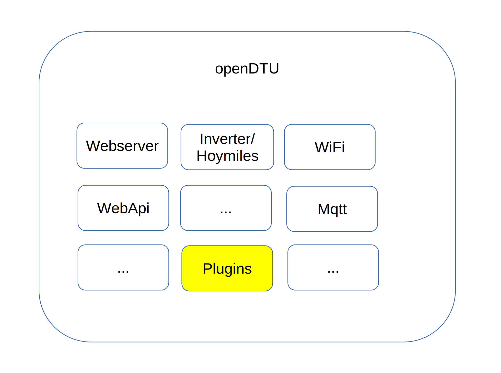
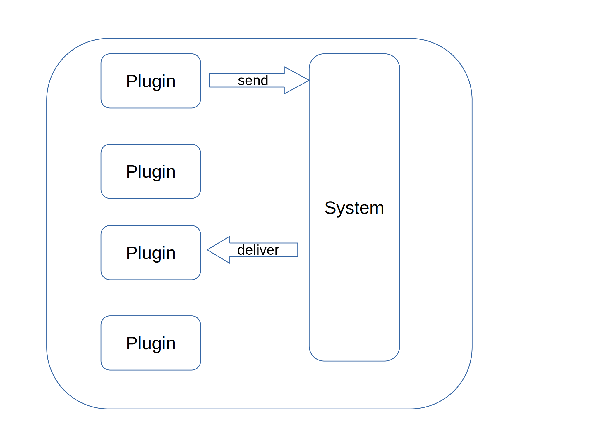
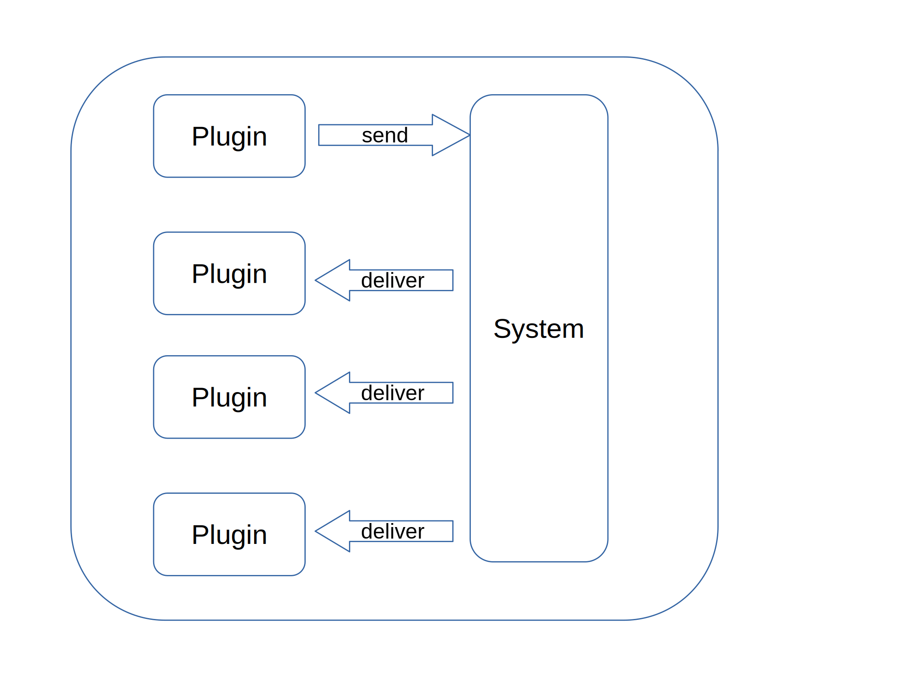
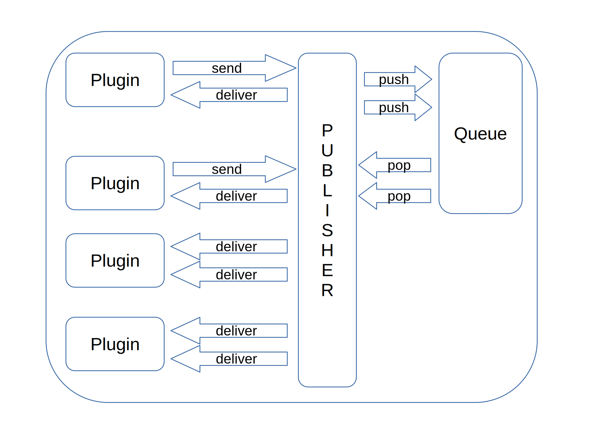
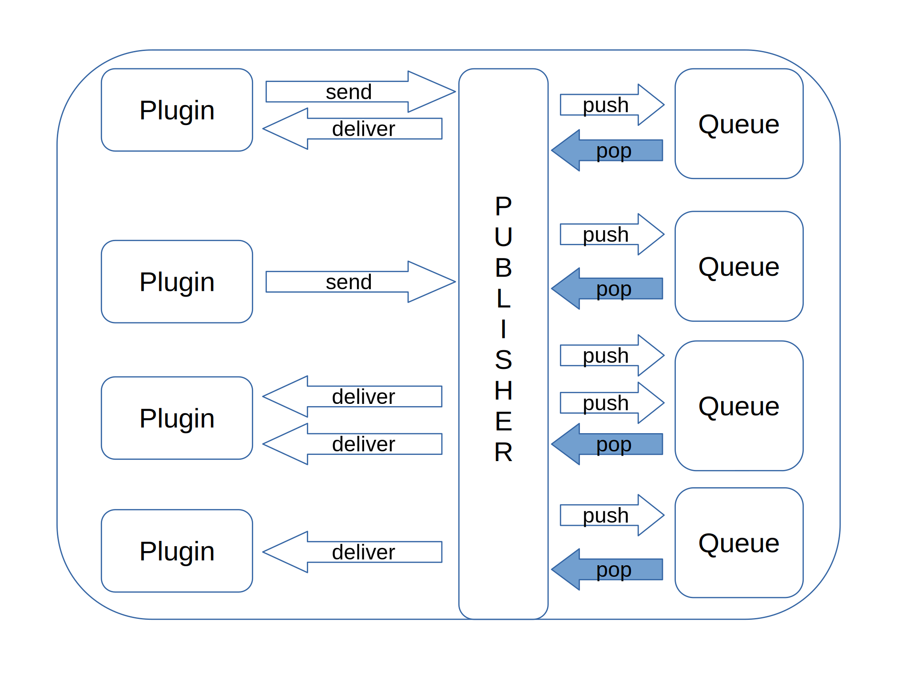
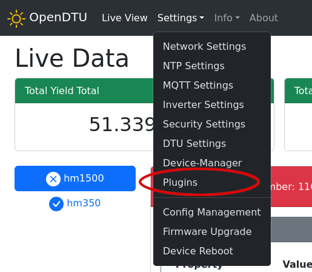
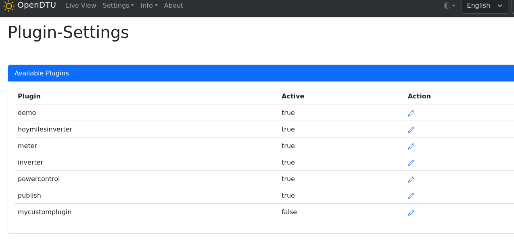
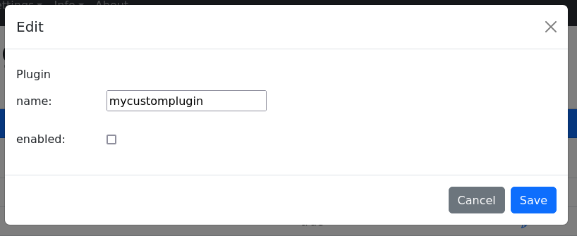
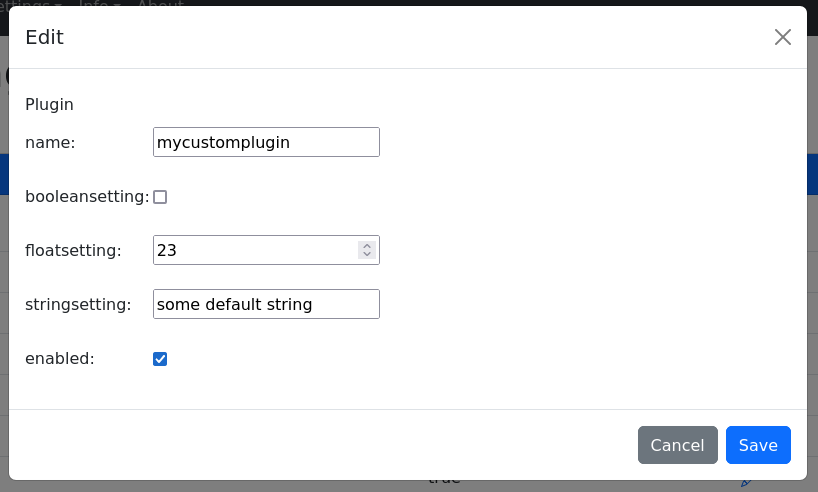

# OpenDTUPP (PluginPlayground)

[](https://github.com/womoak75/OpenDTU/actions/workflows/build.yml)
[](https://github.com/womoak75/OpenDTU/actions/workflows/cpplint.yml)
[](https://github.com/womoak75/OpenDTU/actions/workflows/yarnlint.yml)

## !! IMPORTANT NOTES !!

This project is a C++ learning playground run by a java developer!

## Background

Find the
* [original project documentation here](README_opendtu.md)
* [original project here](https://github.com/tbnobody/OpenDTU)
  
## Intention

Original idea was to dynamically control my Hoymiles inverter to enable a zero export to grid (Nulleinspeisung).



However, I had to learn C++ first! :)  
Now I still don't understand any C++, but fortunately there are [other sw projects available that come close to my wishful thinking (apart from the loose coupling :))](https://github.com/helgeerbe/OpenDTU-OnBattery).  
So i can continue producing core dumps.

## what did i (try to) implement/use?

* extensive use of c++ templates
* data exchange between software modules via messaging (loose coupling)
* multiple data exchange strategies (direct / singlequeue / multiqueue)
* basic plugins (meter/inverter/powercontrol/mqtt)
* minimalistic generic configuration via webui
* minimal dependencies to openDTU code (for easy sync with origin project)
* [loose coupling](https://en.wikipedia.org/wiki/Loose_coupling)
* experimental: use core1 of ESP32 (on dualcore hardware)

## the architecture

### sw parts

We got a system, plugins and messages.  
System provides some basic services (timer callbacks, mqtt subscriptions, configuration, http callbacks, etc.)  
A Plugin is a encapsulated independent software code which is
executed within the main application software loop function (more or less).  
A Plugin can send and receive messages.
Messages can be send to a specific receiver or to all (broadcast).



#### direct message exchange

Each message is send to it's receiver(s) directly, like a syncron function call.  
If the receiver again send message(s) to other receivers ... 
well, i guess you get my point.   
WDT reset probability: 99.99%



#### single queue message exchange

Each message will be inserted into a message queue, which will be processed by 'first-in-first-out' principle.


#### multi queue message exchange

Each message receiver get it's own queue.
A priority-based (by message or receiver) delivery could be implemented easily.



## ATTENTION!

Multi queue message excange comes in two flavours
### broadcast 
Each message will be sent to every plugin (receiver)

or

### subscription
  Each plugin (receiver) has to add a subscription for message types it wants to receive.
  
___Default: multi queue subscription message___


## how to add a custom plugin

Create a MyCustomPlugin.h file.

```c++
#pragma once

#include "base/plugin.h"

class MyCustomPlugin : public Plugin {
public:
  MyCustomPlugin() : Plugin(42, "mycustomplugin") {}

  void setup() {}

  void onTickerSetup() {
    addTimerCb(
        SECOND, 5,
        [&]() {
          PDebug.printf(PDebugLevel::INFO, "MyCustomPlugin: hello ticker!\n");
        },
        "mycustomplugintimer1");
  }
  void loop() {}
};
```
easy-peasy

Open src/Plugins.cpp and add your CustomPlugin to addCustomPlugins()

```c++

#include "MyCustomPlugin.h"
...

void PluginsClass::addCustomPlugins() {

  plugins.push_back(std::make_unique<MyCustomPlugin>(MyCustomPlugin()));

}


```
save and do
```
pio run -t upload -t monitor
```
Plugins are disabled by default.  
So you have to use the WebUI (Settings -> Plugins -> mycustomplugin) to enable it first.








### send mqtt message to plugin

```c++
#pragma once

#include "base/plugin.h"

class MyCustomPlugin : public Plugin {
public:
  MyCustomPlugin() : Plugin(42, "mycustomplugin") {}

  // not needed here
  void setup() {}

  void onMqttSubscribe() { 
    subscribeMqtt((char *)"public/topic", false); 
  }

  void mqttCallback(MqttMessage *message) {
    char buffer[128];
    message->toString(buffer);
    PDebug.printf(PDebugLevel::INFO, "MyCustomPlugin: mqttCallback %s\n",
                  buffer);
  }

  void internalCallback(std::shared_ptr<PluginMessage> message) {
    if (message->isMessageType<MqttMessage>()) {
      MqttMessage *m = (MqttMessage *)message.get();
      mqttCallback(m);
    }
  }

  // not needed here
  void loop() {}
};

```
send message
```
mosquitto_pub -h mqttserver -t "public/topic" -m "hello plugin!"
```

### send json message to plugin

```c++
#pragma once

#include "base/plugin.h"

class MyCustomPlugin : public Plugin {
public:
  MyCustomPlugin() : Plugin(42, "mycustomplugin") {}

  // not needed here
  void setup() {}

  bool onRequest(JsonObject request, JsonObject response) {
    if (request.containsKey("param")) {
      someMember = request["param"];
      update = true;
      return true;
    }
    return false;
  }

  void loop() {
    if (update) {
      update = false;
      PDebug.printf(PDebugLevel::INFO,
                    "MyCustomPlugin: someMember value changed to %d\n",
                    someMember);
    }
  }

private:
  bool update = false;
  int someMember = 0;
};


```
send message
```
curl -v -d '{"plugin":"mycustomplugin","param":23}' http://{opendtupp-ip}/api/plugin/request

```

Keep in mind: ```onRequest``` is called from ESPAsyncWebServer callback.  
Avoid time consuming actions here.  A pretty common approach is to save provided data to member vars, set a flag and do the computation in loop().

### configuration via webui

```c++
#pragma once

#include "base/plugin.h"

class MyCustomPlugin : public Plugin {
public:
  MyCustomPlugin() : Plugin(42, "mycustomplugin") {}

  // not needed here
  void setup() {}

  void saveSettings(JsonObject settings) {
    settings[F("booleansetting")] = booleansetting;
    settings[F("floatsetting")] = floatsetting;
    settings[F("stringsetting")] = stringsetting;
  }

  void loadSettings(JsonObject settings) {
    if (settings.containsKey(F("booleansetting")))
      booleansetting = settings[F("booleansetting")];
    if (settings.containsKey(F("floatsetting")))
      floatsetting = settings[F("floatsetting")];
    if (settings.containsKey(F("stringsetting")))
      settings[F("stringsetting")].as<String>().toCharArray(
          stringsetting, sizeof(stringsetting));
  }

private:
  bool booleansetting = false;
  float floatsetting = 23.0;
  char stringsetting[32] = "some default string";
};


```
got to WebUI (Settings -> Plugins -> mycustomplugin)



no complex data structure possible.
Simple datatypes (bool, int, float, char[]) are supported.


### send custom messages

Open lib/plugin/src/base/plugintypes.h  
and add your own message type id

```c++
...

enum TYPEIDS { 
    DUMMY, 
    FLOATVALUE_TYPE,INTVALUE_TYPE,LONGVALUE_TYPE,BOOLVALUE_TYPE,STRINGVALUE_TYPE,
    PLUGINMESSAGE_TYPE, 
    MQTTMESSAGE_TYPE, 
    DEMOMESSAGE_TYPE, 
    HOYMILESMESSAGE_TYPE,
    HOYMILESLIMITMESSAGE_TYPE,
    INVERTERMESSAGE_TYPE, 
    METERMESSAGE_TYPE, 
    POWERCONTROLMESSAGE_TYPE,
    // add typeid definition here
    MYCUSTOMMESSAGE_TYPE
};
```

create a MyCustomMessage.h file

As we do not rely on rtti support (Real Time Type Information) we have to use our own.
I'm positive an c++ expert would solve this in a smarter way, but i am a hacker and not an expert! :)

```c++
#pragma once

#include "base/pluginmessages.h"

class MyCustomMessage : public PluginMessage {
public:
  MyCustomMessage(Plugin &p) : PluginMessage(TYPEIDS::MYCUSTOMMESSAGE_TYPE, p) {}
  int toString(char *buffer) {
    return sprintf(buffer, "MyCustomMessage{somevalue=%f}", somevalue);
  }
  const char *getMessageTypeString() { return "MyCustomMessage"; }
  float somevalue = 0;
};
template <> struct EntityIds<MyCustomMessage> {
  enum { type_id = TYPEIDS::MYCUSTOMMESSAGE_TYPE };
};
```
We will send our message every 5 seconds as broadcast.  

```c++
#pragma once

#include "base/plugin.h"
#include "MyCustomMessage.h"

class MyCustomPlugin : public Plugin {
public:
  MyCustomPlugin() : Plugin(42, "mycustomplugin") {}

  void onTickerSetup() {
    addTimerCb(
        SECOND, 5,
        [&]() {
          PDebug.printf(PDebugLevel::INFO, "MyCustomPlugin: sending message\n");
          MyCustomMessage m(*this);
          m.somevalue=count++;
          publishMessage(m);
        },
        "mycustomplugintimer1");
  }
  private:
  int count = 0;
};

```

The sender is excluded from message delivery (which makes sense), so we take a look at the debug output.  
['multi queue broadcast mode'](#broadcast)

```
...
MyCustomPlugin: sending message
system: Mycustomplugin publish MyCustomMessage to unknown
mainloop start @core0
----
pluginqueue 'Meter' 14 [ms] - MyCustomMessage{somevalue=0.000000}
powercontrol unhandled message from sender=42
pluginqueue 'Powercontrol' 20 [ms] - MyCustomMessage{somevalue=0.000000}
hoymilesplugin: internalCallback: MyCustomMessage
pluginqueue 'Hoymilesinverter' 32 [ms] - MyCustomMessage{somevalue=0.000000}
pluginqueue 'Publish' 43 [ms] - MyCustomMessage{somevalue=0.000000}
pluginqueue 'Demo' 44 [ms] - MyCustomMessage{somevalue=0.000000}


pluginqueue 'Inverter' 55 [ms] - MyCustomMessage{somevalue=0.000000}

MyCustomPlugin: sending message
system: Mycustomplugin publish MyCustomMessage to unknown
hoymilesplugin: internalCallback: MyCustomMessage
pluginqueue 'Hoymilesinverter' 3 [ms] - MyCustomMessage{somevalue=1.000000}
pluginqueue 'Publish' 33 [ms] - MyCustomMessage{somevalue=1.000000}
pluginqueue 'Demo' 37 [ms] - MyCustomMessage{somevalue=1.000000}

pluginqueue 'Inverter' 38 [ms] - MyCustomMessage{somevalue=1.000000}
pluginqueue 'Meter' 55 [ms] - MyCustomMessage{somevalue=1.000000}

pluginqueue 'Powercontrol' 81 [ms] - MyCustomMessage{somevalue=1.000000}

```

Congratulations!  
We flooded the system with useless information.  
Mission accomplished!

---

To receive a broadcast in 
['multi queue subscription mode'](#subscription) a subscription is necessary.

```c++
class SomeOtherPlugin : public Plugin {

... 

void setup() {
  subscribe<MyCustomMessage>();
}

...

};
```

### send to specific receiver

Instead of broadcast to all we will send your message to a specific receiver.

```c++
#pragma once

#include "base/plugin.h"
#include "MyCustomMessage.h"

class MyCustomPlugin : public Plugin {
public:
  MyCustomPlugin() : Plugin(42, "mycustomplugin") {}

  void onTickerSetup() {
    addTimerCb(
        SECOND, 5,
        [&]() {
          PDebug.printf(PDebugLevel::INFO, "MyCustomPlugin: sending message\n");
          MyCustomMessage m(*this);
          // set specific receiver  
          m.setReceiverId(PluginIds::PluginInverter);
          m.somevalue=count++;
          publishMessage(m);
        },
        "mycustomplugintimer1");
  }
  private:
  int count = 0;
};

```
```PluginIds``` is a generated enum which contains all Ids from available Plugin classes.  
It's automatically generated from a python script.

see platformio.ini
```ini
extra_scripts =
    ...
    pre:${platformio.lib_dir}/plugins/generateIds.py
```


### receive certain messages

We have to override
```c++
void internalCallback(std::shared_ptr<PluginMessage> message)
```

```c++
#pragma once

#include "base/plugin.h"
#include "messages/metermessage.h"

class MyCustomPlugin : public Plugin {
public:
  MyCustomPlugin() : Plugin(42, "mycustomplugin") {}

  void setup() {
    subscribe<MeterMessage>();
  }

  void inverterCallback(MeterMessage *message) {
    char buffer[128];
    message->toString(buffer);
    PDebug.printf(PDebugLevel::INFO, "MyCustomPlugin: inverterCallback %s\n",
                  buffer);
  }

  void internalCallback(std::shared_ptr<PluginMessage> message) {
    if (message->isMessageType<MeterMessage>()) {
      MeterMessage *m = (MeterMessage *)message.get();
      inverterCallback(m);
    }
  }

  // not needed here
  void loop() {}
};

```
Somewhere in the monitor output your debug statement can be found.

```
...

MyCustomPlugin: inverterCallback MeterMessage{base=PluginMessage{sender:2, receiver:0}, meterId=112123456789, power=155.0, unit=W}

...


