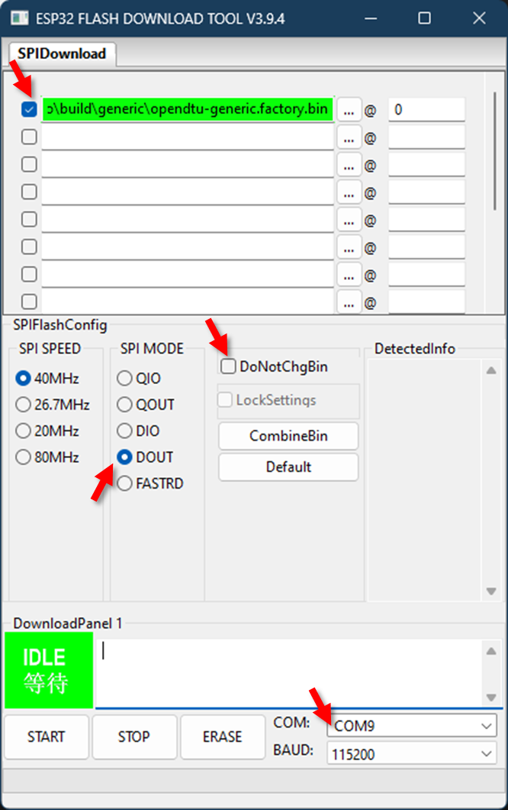

# OpenDTU-OnBattery

This is a fork from the Hoymiles project OpenDTU.


<mark>This README is kept similar to the openDTU project for process reasons.</mark>

<mark>Please refer to the [openDTU-onBattery readme ](README_onBattery.md) for project documentation.</mark>


## Extensions to the original OpenDTU

This project is still under development and adds following features:

> **Warning**
> 
> In contrast to the original openDTU, with release 2023.05.23.post1 openDTU-onBattery supports only 5 inverters. Otherwise, there is not enough memory for the liveData view.

* Support Victron's Ve.Direct protocol on the same chip (cable based serial interface!). Additional information about Ve.direct can be downloaded from https://www.victronenergy.com/support-and-downloads/technical-information.
* Dynamically sets the Hoymiles power limited according to the currently used energy in the household. Needs an HTTP JSON based power meter (e.g. Tasmota), an MQTT based power meter like Shelly 3EM or an SDM power meter.
* Battery support: Read the voltage from Victron MPPT charge controller or from the Hoymiles DC inputs and starts/stops the power producing based on configurable voltage thresholds
* Voltage correction that takes the voltage drop because of the current output load into account (not 100% reliable calculation)
* Can read the current solar panel power from the Victron MPPT and adjust the limiter accordingly to not save energy in the battery (for increased system efficiency). Increases the battery lifespan and reduces energy loses.
* Settings can be configured in the UI
* Pylontech Battery support (via CAN bus interface). Use the SOC for starting/stopping the power output and provide the battery data via MQTT (autodiscovery for home assistant is currently not supported). Pin Mapping is supported (default RX PIN 27, TX PIN 26). Actual no live view support for Pylontech Battery.
* Huawei R4850G2 power supply unit that can act as AC charger. Supports status shown on the web interface and options to set voltage and current limits on the web interface and via MQTT. Connection is done using CAN bus (needs to be separate from Pylontech CAN bus) via SN65HVD230 interface.

[](https://github.com/helgeerbe/OpenDTU-OnBattery/actions/workflows/build.yml)
[](https://github.com/helgeerbe/OpenDTU-OnBattery/actions/workflows/cpplint.yml)
[](https://github.com/helgeerbe/OpenDTU-OnBattery/actions/workflows/yarnlint.yml)

## !! IMPORTANT UPGRADE NOTES !!

If you are upgrading from a version before 15.03.2023 you have to upgrade the partition table of the ESP32. Please follow the [this](docs/UpgradePartition.md) documentation!

## Background

This project was started from [this](https://www.mikrocontroller.net/topic/525778) discussion (Mikrocontroller.net).
It was the goal to replace the original Hoymiles DTU (Telemetry Gateway) with their cloud access. With a lot of reverse engineering the Hoymiles protocol was decrypted and analyzed.

## Screenshots

Several screenshots of the frontend can be found here: [Screenshots](docs/screenshots/README.md)

## Builds

Different builds from existing installations can be found here [Builds](docs/builds/README.md)
Like to show your own build? Just send me a Pull Request.

### Dynamic Power Limiter Interface


####
Power Limiter States


### Web-Live-Interface:


### REST-API (/api/vedirectlivedata/status):
````JSON
{
"data_age":0,
"age_critical":false,
"PID":"SmartSolar MPPT 100|30",
"SER":"XXX",
"FW":"159",
"LOAD":"ON",
"CS":"Bulk",
"ERR":"No error",
"OR":"Not off",
"MPPT":"MPP Tracker active",
"HSDS":{"v":46,"u":"Days"},
"V":{"v":26.36,"u":"V"},
"I":{"v":3.4,"u":"A"},
"VPV":{"v":37.13,"u":"V"},
"PPV":{"v":93,"u":"W"},
"H19":{"v":83.16,"u":"kWh"},
"H20":{"v":1.39,"u":"kWh"},
"H21":{"v":719,"u":"W"},
"H22":{"v":1.43,"u":"kWh"},
"H23":{"v":737,"u":"W"}
}
````

### Home Assistant auto discovery


### Device Manager

Add Victron TX / RX PINs to the device manager

````json
[
    {
        "name": "My very special esp32 test board",
        "victron": {
            "rx": 22,
            "tx": 21
        }
    }
]
````

### MQTT Topics

The base topic, as configured in the web GUI is prepended to all follwing topics.
Serial will be replaced with the serial number of the MPPT device.

## MPPT topics

| Topic                                   | R / W | Description                                          | Value / Unit               |
| --------------------------------------- | ----- | ---------------------------------------------------- | -------------------------- |
| victron/[serial]/PID                    | R     | Product description                                  | text                       |
| victron/[serial]/SER                    | R     | Serial number                                        | text                       |
| victron/[serial]/FW                     | R     | Firmware number                                      | int                        |
| victron/[serial]/LOAD                   | R     | Load output state                                    | ON /  OFF                  |
| victron/[serial]/CS                     | R     | State of operation                                   | text e. g. "Bulk"          |
| victron/[serial]/ERR                    | R     | Error code                                           | text e. g. "No error"      |
| victron/[serial]/OR                     | R     | Off reasen                                           | text e. g. "Not off"       |
| victron/[serial]/MPPT                   | R     | Tracker operation mode                               | text e. g. "MPP Tracker active" |
| victron/[serial]/HSDS                   | R     | Day sequence number (0...364)                        | int in days                |

## Battery specific topics

| Topic                                   | R / W | Description                                          | Value / Unit               |
| --------------------------------------- | ----- | ---------------------------------------------------- | -------------------------- |
| victron/[serial]/V                      | R     | Voltage                                              | Volt (V)                   |
| victron/[serial]/I                      | R     | Current                                              | Ampere (A)                 |

## Panel specific topics

| Topic                                   | R / W | Description                                          | Value / Unit               |
| --------------------------------------- | ----- | ---------------------------------------------------- | -------------------------- |
| victron/[serial]/VPV                    | R     | Voltage                                              | Volt (V)                   |
| victron/[serial]/PPV                    | R     | Power                                                | Watt (W)                   |
| victron/[serial]/H19                    | R     | Yield total (user resettable counter)                | Kilo watt hours (kWh)      |
| victron/[serial]/H20                    | R     | Yield today                                          | Kilo watt hours (kWh)      |
| victron/[serial]/H21                    | R     | Maximum power today                                  | Watt (W)                   |
| victron/[serial]/H22                    | R     | Yield yesterday                                      | Kilo watt hours (kWh)      |
| victron/[serial]/H23                    | R     | Maximum power yesterday                              | Watt (W)                   |

## Power Meter (Shelly 3EM) topics

Topics for 3 phases of a power meter is configurable. Given is an example for the Shelly 3EM. Positive values mean power import, negative values mean power export to the grid.

| Topic                                   | R / W | Description                                          | Value / Unit               |
| --------------------------------------- | ----- | ---------------------------------------------------- | -------------------------- |
| shellies/[Shelly Name]/emeter/0/power   | w     | Power Phase 0                                         | Watt (W)                    |
| shellies/[Shelly Name]/emeter/1/power   | w     | Power Phase 1                                         | Watt (W)                    |
| shellies/[Shelly Name]/emeter/2/power   | w     | Power Phase 2                                         | Watt (W)                   |

## Pylontech Battery topics

| Topic                                   | R / W | Description                                          | Value / Unit               |
| --------------------------------------- | ----- | ---------------------------------------------------- | -------------------------- |
| battery/settings/chargeVoltage         | R     | Voltage                                              | Volt (V)                   |
| battery/settings/chargeCurrentLimitation | R     |                                               |                    |
| battery/settings/dischargeCurrentLimitation | R     |                                               |                |
| battery/stateOfCharge         | R     |                                               |                   |
| battery/stateOfHealth        | R     |                                               |                   |
| battery/voltage         | R     |                                               |                   |
| battery/current         | R     |                                               |                   |
| battery/temperature"         | R     |                                               |                   |
| battery/alarm/overCurrentDischarge        | R     |                                               |                   |
| battery/alarm/underTemperature        | R     |                                               |                    |
| battery/alarm/overTemperature         | R     |                                               |                  |
| battery/alarm/underVoltage         | R     |                                               |                   |
| battery/alarm/overVoltage         | R     |                                               |                  |
| battery/alarm/bmsInternal         | R     |                                               |                   |
| battery/alarm/overCurrentCharge        | R     |                                               |                   |
| battery/warning/highCurrentDischarge     | R     |                                               |                   |
| battery/warning/lowTemperature        | R     |                                               |                    |
| battery/warning/highTemperature        | R     |                                               |                    |
| battery/warning/lowVoltage         | R     |                                               |                  |
| battery/warning/highVoltage         | R     |                                               |                    |
| battery/warning/bmsInternal        | R     |                                               |                   |
| battery/manufacturer   | R     |                                               |                    |
| battery/charging/chargeEnabled        | R     |                                               |                    |
| battery/charging/dischargeEnabled        | R     |                                               |                    |
| battery/charging/chargeImmediately       | R     |                                               |                    |

## Huawei AC charger topics
| Topic                                   | R / W | Description                                          | Value / Unit               |
| --------------------------------------- | ----- | ---------------------------------------------------- | -------------------------- |
| huawei/cmd/limit_online_voltage         | W     | Online voltage (i.e. CAN bus connected)              | Volt (V)                   |
| huawei/cmd/limit_online_current         | W     | Online current (i.e. CAN bus connected)              | Ampere (A)                 |
| huawei/cmd/limit_offline_voltage        | W     | Offline voltage (i.e. CAN bus not connected)         | Volt (V)                   |
| huawei/cmd/limit_offline_current        | W     | Offline current (i.e. CAN bus not connected)         | Ampere (A)                 |
| huawei/cmd/power                        | W     | Controls output pin GPIO to drive solid state relais | 0 / 1                      |
| huawei/data_age                         | R     | How old the data is                                  | Seconds                    |
| huawei/input_voltage                    | R     | Input voltage                                        | Volt (V)                   |
| huawei/input_current                    | R     | Input current                                        | Ampere (A)                 |
| huawei/input_power                      | R     | Input power                                          | Watt (W)                   |
| huawei/output_voltage                   | R     | Output voltage                                       | Volt (V)                   |
| huawei/output_current                   | R     | Output current                                       | Ampere (A)                 |
| huawei/max_output_current               | R     | Maximum output current (set using the online limit)  | Ampere (A)                 |
| huawei/output_power                     | R     | Output power                                         | Watt (W)                   |
| huawei/input_temp                       | R     | Input air temperature                                | °C                         |
| huawei/output_temp                      | R     | Output air temperature                               | °C                         |
| huawei/efficiency                       | R     | Efficiency                                           | Percentage                 |

## Power Limiter topics
| Topic                                   | R / W | Description                                          | Value / Unit               |
| --------------------------------------- | ----- | ---------------------------------------------------- | -------------------------- |
| powerlimiter/cmd/disable                | W     | Power Limiter disable override for external PL control | 0 / 1                    |
| powerlimiter/status/disabled            | R     | Power Limiter disable override status                | 0 / 1                    |

## Currently supported Inverters

| Model               | Required RF Module | DC Inputs | MPP-Tracker | AC Phases |
| --------------------| ------------------ | --------- | ----------- | --------- |
| Hoymiles HM-300     | NRF24L01+          | 1         | 1           | 1         |
| Hoymiles HM-350     | NRF24L01+          | 1         | 1           | 1         |
| Hoymiles HM-400     | NRF24L01+          | 1         | 1           | 1         |
| Hoymiles HM-600     | NRF24L01+          | 2         | 2           | 1         |
| Hoymiles HM-700     | NRF24L01+          | 2         | 2           | 1         |
| Hoymiles HM-800     | NRF24L01+          | 2         | 2           | 1         |
| Hoymiles HM-1000    | NRF24L01+          | 4         | 2           | 1         |
| Hoymiles HM-1200    | NRF24L01+          | 4         | 2           | 1         |
| Hoymiles HM-1500    | NRF24L01+          | 4         | 2           | 1         |
| Hoymiles HMS-300    | CMT2300A           | 1         | 1           | 1         |
| Hoymiles HMS-350    | CMT2300A           | 1         | 1           | 1         |
| Hoymiles HMS-400    | CMT2300A           | 1         | 1           | 1         |
| Hoymiles HMS-450    | CMT2300A           | 1         | 1           | 1         |
| Hoymiles HMS-500    | CMT2300A           | 1         | 1           | 1         |
| Hoymiles HMS-600    | CMT2300A           | 2         | 2           | 1         |
| Hoymiles HMS-700    | CMT2300A           | 2         | 2           | 1         |
| Hoymiles HMS-800    | CMT2300A           | 2         | 2           | 1         |
| Hoymiles HMS-900    | CMT2300A           | 2         | 2           | 1         |
| Hoymiles HMS-1000   | CMT2300A           | 2         | 2           | 1         |
| Hoymiles HMS-1600   | CMT2300A           | 4         | 4           | 1         |
| Hoymiles HMS-1800   | CMT2300A           | 4         | 4           | 1         |
| Hoymiles HMS-2000   | CMT2300A           | 4         | 4           | 1         |
| Hoymiles HMT-1800   | CMT2300A           | 6         | 3           | 3         |
| Hoymiles HMT-2250   | CMT2300A           | 6         | 3           | 3         |
| Solenso SOL-H350    | NRF24L01+          | 1         | 1           | 1         |
| Solenso SOL-H400    | NRF24L01+          | 1         | 1           | 1         |
| Solenso SOL-H800    | NRF24L01+          | 2         | 2           | 1         |
| TSUN TSOL-M350      | NRF24L01+          | 1         | 1           | 1         |
| TSUN TSOL-M800      | NRF24L01+          | 2         | 2           | 1         |
| TSUN TSOL-M1600     | NRF24L01+          | 4         | 2           | 1         |

**TSUN compatibility remark:**
Compatibility with OpenDTU is most likly related to the serial number of the inverter. Current findings indicate that TSUN inverters with a serial number starting with "11" are supported, whereby inverters with a serial number starting with "10" are not.

## Features for end users

* Read live data from inverter
* Show inverters internal event log
* Show inverter information like firmware version, firmware build date, hardware revision and hardware version
* Show and set the current inverter limit
* Function to turn the inverter off and on
* Uses ESP32 microcontroller and NRF24L01+
* Multi-Inverter support
* MQTT support (with TLS)
* Home Assistant MQTT Auto Discovery support
* Nice and fancy WebApp with visualization of current data
* Firmware upgrade using the web UI
* Default source supports up to 10 inverters
* Time zone support
* Ve.Direct interface (via web-interface, REST-api, or MQTT)
* Ethernet support
* Prometheus API endpoint (/api/prometheus/metrics)
* English, german and french web interface
* Displays (SSD1306, SH1106, PCD8544)
* Status LEDs
* Configuration management (export / import configurations)
* Dark Theme

## Features for developers

* The microcontroller part
  * Build with Arduino PlatformIO Framework for the ESP32
  * Uses a fork of [ESPAsyncWebserver](https://github.com/yubox-node-org/ESPAsyncWebServer) and [espMqttClient](https://github.com/bertmelis/espMqttClient)

* The WebApp part
  * Build with [Vue.js](https://vuejs.org)
  * Source is written in TypeScript

## Breaking changes

Generated using: `git log --date=short --pretty=format:"* %h%x09%ad%x09%s" | grep BREAKING`

```code
* 59f43a8       2023-04-17      BREAKING CHANGE: Web API Endpoint /api/devinfo/status requires GET parameter inv=
* 318136d       2023-03-15      BREAKING CHANGE: Updated partition table: Make sure you have a configuration backup and completly reflash the device!
* 3b7aef6       2023-02-13      BREAKING CHANGE: Web API!
* d4c838a       2023-02-06      BREAKING CHANGE: Prometheus API!
* daf847e       2022-11-14      BREAKING CHANGE: Removed deprecated config parsing method
* 69b675b       2022-11-01      BREAKING CHANGE: Structure WebAPI /api/livedata/status changed
* 27ed4e3       2022-10-31      BREAKING: Change power factor from percent value to value between 0 and 1
```

## Hardware you need

### ESP32 board

For ease of use, buy a "ESP32 DEVKIT DOIT" or "ESP32 NodeMCU Development Board" with an ESP32-S3 or ESP-WROOM-32 chipset on it.

Sample Picture:


Also supported: Board with Ethernet-Connector and Power-over-Ethernet [Olimex ESP32-POE](https://www.olimex.com/Products/IoT/ESP32/ESP32-POE/open-source-hardware)

### NRF24L01+ radio board (See inverter table above for supported inverters)

The PLUS sign is IMPORTANT! There are different variants available, with antenna on the printed circuit board or external antenna.

Sample picture:


Buy your hardware from a trusted source, at best from a dealer/online shop in your country where you have support and the right to return non-functional hardware.
When you want to buy from Amazon, AliExpress, eBay etc., take note that there is a lot of low-quality or fake hardware offered. Read customer comments and ratings carefully!

A heavily incomplete list of trusted hardware shops in germany is:

* [AZ-Delivery](https://www.az-delivery.de/)
* [Makershop](https://www.makershop.de/)
* [Berrybase](https://www.berrybase.de/)

This list is for your convenience only, the project is not related to any of these shops.

### CMT2300A radio board  (See inverter table above for supported inverters)

It is important to get a module which supports SPI communicatiton. The following modules are currently supported:

* EBYTE E49-900M20S

The CMT2300A uses 3-Wire half duplex SPI communication. Due to this fact it currently requires a separate SPI bus. If you want to run the CMT2300A module on the same ESP32 as a NRF24L01+ module or a PCD8544 display make sure you get a ESP which supports 2 SPI busses. Currently the SPI bus host is hardcoded to number 2. This may change in future.

### Power supply

Use a power suppy with 5 V and 1 A. The USB cable connected to your PC/Notebook may be powerful enough or may be not.

## Wiring up the NRF24L01+ module

### Schematic


### Symbolic view


### Change pin assignment

Its possible to change all the pins of the NRF24L01+ module, the Display, the LED etc.
The recommend way to change the pin assignment is by creating a custom [device profile](docs/DeviceProfiles.md).
It is also possible to create a custom environment and compile the source yourself. This can be achieved by copying one of the [env:....] sections from 'platformio.ini' to 'platformio_override.ini' and editing the 'platformio_override.ini' file and add/change one or more of the following lines to the 'build_flags' parameter:

```makefile
-DHOYMILES_PIN_MISO=19
-DHOYMILES_PIN_MOSI=23
-DHOYMILES_PIN_SCLK=18
-DHOYMILES_PIN_IRQ=16
-DHOYMILES_PIN_CE=4
-DHOYMILES_PIN_CS=5
-DVICTRON_PIN_TX=21
-DVICTRON_PIN_RX=22
-DPYLONTECH_PIN_RX=27
-DPYLONTECH_PIN_TX=14
```

It is recommended to make all changes only in the  'platformio_override.ini', this is your personal copy.

## Flashing and starting up

### with Visual Studio Code

* Install [Visual Studio Code](https://code.visualstudio.com/download) (from now named "vscode")
* In Visual Studio Code, install the [PlatformIO Extension](https://marketplace.visualstudio.com/items?itemName=platformio.platformio-ide)
* Install git and enable git in vscode - [git download](https://git-scm.com/downloads/) - [Instructions](https://www.jcchouinard.com/install-git-in-vscode/)
* Clone this repository (you really have to clone it, don't just download the ZIP file. During the build process the git hash gets embedded into the firmware. If you download the ZIP file a build error will occur): Inside vscode open the command palette by pressing `CTRL` + `SHIFT` + `P`. Enter `git clone`, add the repository-URL `https://github.com/tbnobody/OpenDTU`. Next you have to choose (or create) a target directory.
* In vscode, choose File --> Open Folder and select the previously downloaded source code. (You have to select the folder which contains the "platformio.ini" and "platformio_override.ini" file)
* Adjust the COM port in the file "platformio_override.ini" for your USB-to-serial-converter. It occurs twice:
  * upload_port
  * monitor_port
* Select the arrow button in the blue bottom status bar (PlatformIO: Upload) to compile and upload the firmware. During the compilation, all required libraries are downloaded automatically.
* Under Linux, if the upload fails with error messages "Could not open /dev/ttyUSB0, the port doesn't exist", you can check via ```ls -la /dev/tty*``` to which group your port belongs to, and then add your user this group via ```sudo adduser <yourusername> dialout``` (if you are using ```arch-linux``` use: ```sudo gpasswd -a <yourusername> uucp```, this method requires a logout/login of the affected user).
* There are two videos showing these steps:
  * [Git Clone and compilation](https://youtu.be/9cA_esv3zeA)
  * [Full installation and compilation](https://youtu.be/xs6TqHn7QWM)

### on the commandline with PlatformIO Core

* Install [PlatformIO Core](https://platformio.org/install/cli)
* Clone this repository (you really have to clone it, don't just download the ZIP file. During the build process the git hash gets embedded into the firmware. If you download the ZIP file a build error will occur)
* Adjust the COM port in the file "platformio_override.ini". It occurs twice:
  * upload_port
  * monitor_port
* build: `platformio run -e generic`
* upload to esp module: `platformio run -e generic -t upload`
* other options:
  * clean the sources:  `platformio run -e generic -t clean`
  * erase flash: `platformio run -e generic -t erase`

### using the pre-compiled .bin files

The pre-compiled binary files can be found here on the [github page behind "Releases"](https://github.com/tbnobody/OpenDTU/releases) (look at the right column). For a first installation on an ESP32, download `opendtu-generic.factory.bin` and use a ESP32 flash tool of your choice to flash the `.bin` file to the address `0x0`. (The previous method with different .bin files is no more necessary.)

For further updates download `opendtu-generic.bin` and use the over-the-air firmware update in OpenDTU's web interface.

#### Flash with esptool.py (Linux)

```bash
esptool.py --port /dev/ttyUSB0 --chip esp32 --before default_reset --after hard_reset \
  write_flash --flash_mode dout --flash_freq 40m --flash_size detect \
  0x0 opendtu-generic.factory.bin
```

#### Flash with Espressif Flash Download Tool (Windows)

[Download link](https://www.espressif.com/en/support/download/other-tools)

* On startup, select Chip Type -> "ESP32" / WorkMode -> "Develop"
* Prepare all settings (see picture). Make sure to uncheck the `DoNotChgBin` option. Otherwise you may get errors like "invalid header".
* 
* Press "Erase" button on screen. Look into the terminal window, you should see dots appear. Then press  the "Boot" button on the ESP32 board. Wait for "FINISH" to see if flashing/erasing is done.
* To program, press "Start" on screen, then the "Boot" button.
* When flashing is complete (FINISH appears) then press the Reset button on the ESP32 board (or powercycle ) to start the OpenDTU application.

#### Flash with ESP_Flasher (Windows)

Users report that [ESP_Flasher](https://github.com/Jason2866/ESP_Flasher/releases/) is suitable for flashing OpenDTU on Windows.

#### Flash with [ESP_Flasher](https://espressif.github.io/esptool-js/) - web version

It is also possible to flash it via the web tools which might be more convenient and is platform independent.

## First configuration

* After the initial flashing of the microcontroller, an Access Point called "OpenDTU-*" is opened. The default password is "openDTU42".
* Use a web browser to open the address [http://192.168.4.1](http://192.168.4.1)
* Navigate to Settings --> Network Settings and enter your WiFi credentials. The username to access the config menu is "admin" and the password the same as for accessing the Access Point (default: "openDTU42").
* OpenDTU then simultaneously connects to your WiFi AP with these credentials. Navigate to Info --> Network and look into section "Network Interface (Station)" for the IP address received via DHCP.
* If your WiFi AP uses an allow-list for MAC-addresses, please be aware that the ESP32 has two different MAC addresses for its AP and client modes, they are also listed at Info --> Network.
* When OpenDTU is connected to a configured WiFI AP, the "OpenDTU-*" Access Point is closed after 3 minutes.
* OpenDTU needs access to a working NTP server to get the current date & time. Both are sent to the inverter with each request. Default NTP server is pool.ntp.org. If your network has different requirements please change accordingly (Settings --> NTP Settings).
* Add your inverter in the inverter settings (Settings --> Inverter Settings)

## Flashing an Update using "Over The Air" OTA Update

Once you have your OpenDTU running and connected to WLAN, you can do further updates through the web interface.
Navigate to Settings --> Firmware upgrade and press the browse button. Select the firmware file from your local computer.

You'll find the firmware file (after a successful build process) under `.pio/build/generic/firmware.bin`.

If you downloaded a precompiled zip archive, unpack it and choose `opendtu-generic.bin`.

After the successful upload, the OpenDTU immediately restarts into the new firmware.

## MQTT Topic Documentation

A documentation of all available MQTT Topics can be found here: [MQTT Documentation](docs/MQTT_Topics.md)

## Web API Documentation

A documentation of the Web API can be found here: [Web-API Documentation](docs/Web-API.md)

## OpenDTU Breakoutboard
We sat down together and designed a PCB. This is 100% compatible with openDTU and has space for all extensions such as display and LEDs. You can find the PCB design here: https://github.com/marove2000/openDTU_BreakoutBoard

A ready to solder kit can be found here: https://shop.blinkyparts.com/en/OpenDTU-Your-evaluation-for-your-balcony-solar-system/blink237542


## Available cases

* <https://www.thingiverse.com/thing:5435911>
* <https://www.printables.com/model/293003-sol-opendtu-esp32-nrf24l01-case>
* <https://www.thingiverse.com/thing:5661780>
* <https://www.thingiverse.com/thing:5632374>
* <https://www.thingiverse.com/thing:5852233>
* <https://www.printables.com/model/377994-opendtu-pcb-box-for-the-wider-board>
* <https://www.printables.com/model/376840-esp32-ahoy-opendtu-pcb-housing>

## Available layouts for printed circuit boards

* [BreakoutBoard - sample printed circuit board for OpenDTU and Ahoy](https://github.com/dokuhn/openDTU-BreakoutBoard)
* [Board for OpenDTU with Display](https://github.com/SteffMUC/openDTU_wDisplay2)
* [OpenDTU PCB mit Display](https://github.com/turrican944/OpenDTU-PCB)
* [PCB for OpenDTU in Cable Branchbox](https://github.com/plewka/ESP-Solar_OpenDTU)

## Building

* Building the WebApp
  * The WebApp can be build using yarn

    ```bash
    cd webapp
    yarn install
    yarn build
    ```

  * The updated output is placed in the 'webapp_dist' directory
  * It is only necessary to build the webapp when you made changes to it
* Building the microcontroller firmware
  * Visual Studio Code with the PlatformIO Extension is required for building

## Troubleshooting

* First: When there is no light on the solar panels, the inverter completely turns off and does not answer to OpenDTU! So if you assembled your OpenDTU in the evening, wait until tomorrow.
* When there is no data received from the inverter(s) - try to reduce the distance between the openDTU and the inverter (e.g. move it to the window towards the roof)
* Under Settings -> DTU Settings you can increase the transmit power "PA level". Default is "minimum".
* The NRF24L01+ needs relatively much current. With bad power supply (and especially bad cables!) a 10 µF capacitor soldered directly to the NRF24L01+ board connector brings more stability (pin 1+2 are the power supply). Note the polarity of the capacitor…
* You can try to use an USB power supply with 1 A or more instead of connecting the ESP32 to the computer.
* Try a different USB cable. Once again, a stable power source is important. Some USB cables are made of much plastic and very little copper inside.
* Double check that you have a radio module NRF24L01+ with a plus sign at the end. NRF24L01 module without the plus are not compatible with this project.
* There is no possibility of auto-discovering the inverters. Double check you have entered the serial numbers of the inverters correctly.
* OpenDTU needs access to a working NTP server to get the current date & time.
* If your problem persists, check the  [Issues on Github](https://github.com/tbnobody/OpenDTU/issues). Please inspect not only the open issues, also the closed issues contain useful information.
* Another source of information are the [Discussions](https://github.com/tbnobody/OpenDTU/discussions/)
* When flashing with VSCode Plattform.IO fails and also with ESPRESSIF tool a demo bin file cannot be flashed to the ESP32 with error message "A fatal error occurred: MD5 of file does not match data in flash!" than un-wire/unconnect ESP32 from the NRF24L01+ board. Try to flash again and rewire afterwards.
* Make sure to connect one inverter only to one DTU (Original, Ahoy, OpenDTU doesn't make a difference). If you query a inverter by multiple DTUs you will get strange peaks in your values.

## Related Projects

* [Ahoy](https://github.com/grindylow/ahoy)
* [DTU Simulator](https://github.com/Ziyatoe/DTUsimMI1x00-Hoymiles)
* [OpenDTU extended to talk to Victrons MPPT battery chargers (Ve.Direct)](https://github.com/helgeerbe/OpenDTU_VeDirect)
