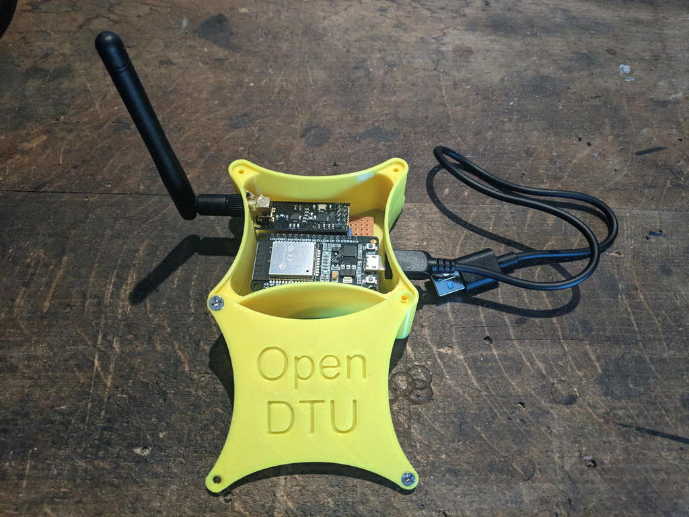
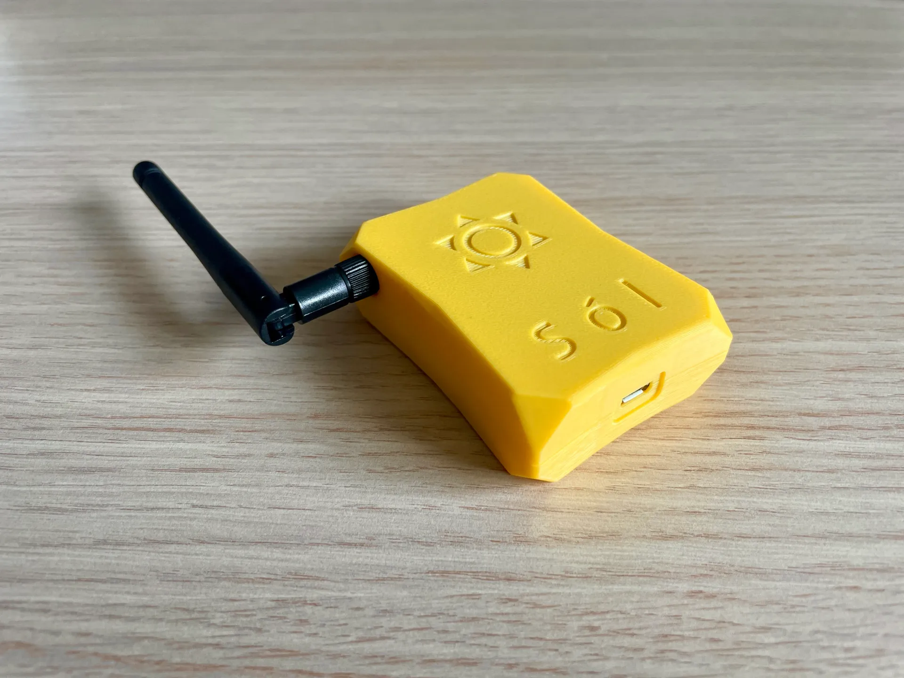
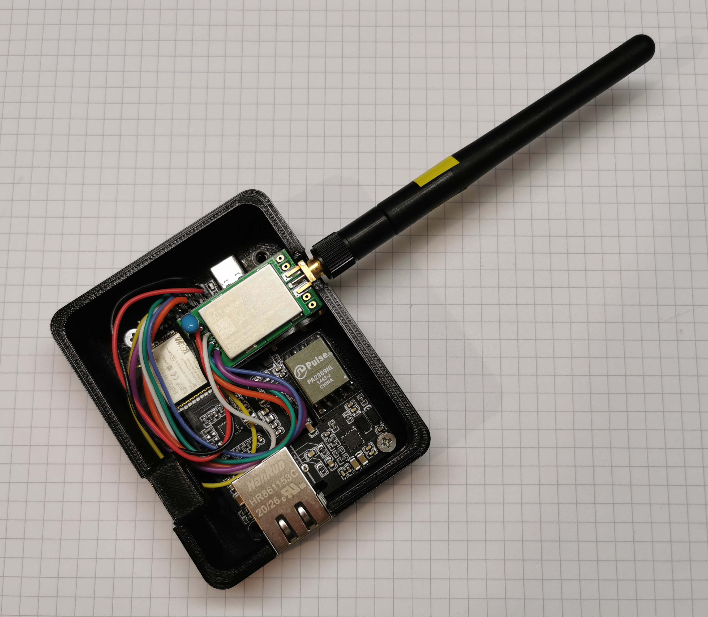

# Builds using different boards

## ESP32 Dev Board
### Build by @Marc--
* Used build environment: generic
* Case: https://www.thingiverse.com/thing:5435911

### Build by @cepresso
* Used build environment: generic
* Case: https://www.printables.com/de/model/293003-sol-opendtu-esp32-nrf24l01-case

## LILYGO® TTGO T-Internet-POE
### Build by @fromCologne
* Used build environment: LilyGO_T_ETH_POE
* Board info: http://www.lilygo.cn/claprod_view.aspx?TypeId=21&Id=1344&FId=t28:21:28
* Case: https://www.thingiverse.com/thing:5244895
